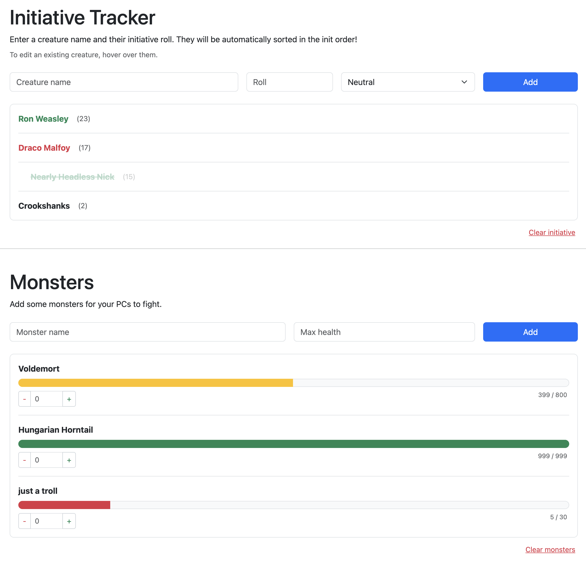

# DM Screen

During the pandemic I picked up D&D as a hobby. As an engineer, I thought "how can I over-engineer a simple thing such as tracking initiative order." And so here we are. Bonus points for tracking monster health as well!

---

## Running locally
1. Install angular `npm install -g @angular/cli`
2. Set up a new project `ng new my-app`
3. Navigate to the project `cd my-app`
4. Spin up a local server `ng serve`
5. Navigate to `http://localhost:4200`

## Deploying to Github pages
1. Navigate to the Angular app `cd my-app`
2. `ng build --output-path ../docs --base-href /repo-name/`
    - `--output-path` indicates where to build the files, and `../docs` adds that directory to root (this is what works for my setup)
    - `--base-href` sets the application base path
